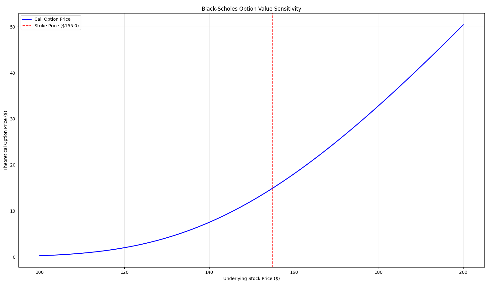

 # black_scholes_option_pricer  

NOTE :- This project was made by me in Mar'25, subsequently preserved and published on Apr11'26.

THEORY :-

Black-Scholes Option Pricing Engine

==> A Python-based quantitative tool for calculating the theoretical price of European call options using the Black-Scholes-Merton model. This project includes a sensitivity analysis engine and visualization of price dynamics relative to the underlying asset.

==> The Black-Scholes model estimates the fair market value of an option by assuming stock prices follow a Geometric Brownian Motion with constant drift and volatility.

1. The Pricing Formula

==> For a non-dividend-paying European call option, the price C is calculated as:

=> $$C = S_t N(d_1) - K e^{-rt} N(d_2)$$

Where the components d_1 and d_2 are defined as:

=> $$d_1 = \frac{\ln(\frac{S_t}{K}) + (r + \frac{\sigma^2}{2})t}{\sigma \sqrt{t}}$$

=> $$d_2 = d_1 - \sigma \sqrt{t}$$

2. Variable Definitions

=> $$​S_t$$ (Underlying Price): The current market price of the asset.

=> $$​K$$ (Strike Price): The pre-agreed price at which the option holder can buy the asset.

=> $$​T$$ (Time to Maturity): Time remaining until expiration (expressed in years).

=> $$​r$$ (Risk-free Rate): The theoretical rate of return of an investment with zero risk (e.g., U.S. Treasury bonds).

=> $$​\sigma$$ (Volatility): The standard deviation of the asset's returns; a measure of market uncertainty.

=> $$​N(\cdot)$$: The Cumulative Distribution Function (CDF) of the standard normal distribution.

3. ​Implementation Details

​The script is structured into three distinct layers:

==> ​The Logic Layer (black_scholes_call): 

 => Uses numpy for efficient log and square root calculations.
 
 => ​Uses scipy.stats.norm to calculate the normal distribution's cumulative probability (the "Delta" of the option).
 
 => ​Includes input validation to ensure $$S$$, $$K$$, $$T$$, and $$\sigma$$ remain within mathematically valid (positive) bounds.
 
==> ​The Reporting Layer: 

 => Outputs a clean "Quant Report" to the terminal, providing the instantaneous theoretical value based on the provided inputs.

==> ​The Visualization Layer: 

 => Generates a range of stock prices using $$np.linspace$$.
 
 => ​Iteratively maps the pricing function across that range to create a sensitivity curve.

​Visual Analysis

==> ​The generated plot illustrates the Option Value Sensitivity (frequently referred to as the option's "intrinsic + time value" curve).


==> ​Key Observations from the Graph:

 => ​Convexity (Gamma): Notice the curve is not a straight line. As the stock price S approaches the strike price $$K$$ (the red dashed line), the rate of change in the option price increases. This "curvature" represents Gamma.
 
 => ​In-the-Money (ITM): To the right of the red line (**S>$155**), the option gains "Intrinsic Value." The curve begins to look more linear as it approaches a Delta of 1.0.
 
 => ​Out-of-the-Money (OTM): To the left of the red line (**S<$155**), the option has no intrinsic value. Its price is composed entirely of "Extrinsic (Time) Value," which decays toward zero as the stock price falls further away from the strike.
 
 => ​At-the-Money (ATM): At exactly **S=$155**, the option's value is purely functional of volatility and time

Results

==> Market Data Inputs

 => Stock Price ($S$): $150.0

 => Strike Price ($K$): $155.0

 => Time to Maturity ($T$): 0.5 years (6 months)

 => Risk-free Rate ($r$): 0.05 (5%)

 => Volatility ($\sigma$): 0.30 (30%)

==> Metric Value Interpretation

 => Call Option Price = **$12.14** :- The fair theoretical value today.

 => $$Delta (N(d_1)) = 0.528$$ :- For every $1 move in the stock, the option moves ~$0.53.

 => $$Exercise Prob. (N(d_2)) = 44.3%$$ :- The theoretical likelihood that the stocks end above $155

 7. Interpretation:

==> Even though the stock price ($150) is currently lower than the strike price ($155), the option still has a value of $12.14. This is due to Time Value and Volatility—there is a statistical chance that the stock will climb above $155 within the next 6 months.

8. Core Packages :-

==> NumPy: Used for vectorized logarithmic and exponential calculations (computing $$d_1$$, $$d_2$$, and the continuous discounting factor $$e^{-rT}$$).

==> SciPy (`scipy.stats`): Utilized for the Cumulative Distribution Function (CDF) of the standard normal distribution, essential for calculating the delta-adjusted probabilities. 

9. Installation :-

==> Cloning the repository :-

```bash
git clone https://github.com/SauravSujitChakraborty/black_scholes_option_pricer.git && cd black_scholes_option_pricer
```
==> Create and activate environment

```bash
python -m venv venv
# On macOS/Linux:
source venv/bin/activate  
# On Windows:
venv\Scripts\activate
```
==> Installing the dependencies :-

```bash
pip install -r requirements.txt
```
==> Running the Black Scholes Option Pricer:

```bash
python ‎black-scholes_option_pricing.py‎
```


 

 

